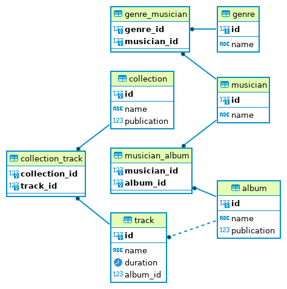

# music_service_db
Demo sql code and ER-diagram for music service.

Condition for create TABLE you see this [link](https://github.com/netology-code/sqlcpp-homeworks/tree/main/02)

## ER-diagram

## SQL code for create tables 
<https://github.com/SaaFomenko/music_service_db/blob/main/create_tb.sql>

## INSERT and SELECT of tables.
Condition you see this [link](https://github.com/netology-code/sqlcpp-homeworks/tree/main/03)

### Content links
<https://music.yandex.ru/album/9526177>
<https://zaycev.net/musicset/operasongs.shtml>
<https://muzlike.me/album/2016-mark-ermler-populyarnaya-sovetskaya-klassika>
<https://musify.club/release/mark-ermler-a-p-borodin-knyaz-igor-cd-2-2002-1702214>
<https://ru.wikipedia.org/wiki/%D0%A1%D0%BF%D0%B8%D1%81%D0%BE%D0%BA_%D0%BF%D1%80%D0%BE%D0%B8%D0%B7%D0%B2%D0%B5%D0%B4%D0%B5%D0%BD%D0%B8%D0%B9_%D0%90%D0%BB%D0%B5%D0%BA%D1%81%D0%B0%D0%BD%D0%B4%D1%80%D0%B0_%D0%91%D0%BE%D1%80%D0%BE%D0%B4%D0%B8%D0%BD%D0%B0>
<https://musify.club/release/evgenii-svetlanov-antologiya-russkoi-simfonicheskoi-muziki-cd5-a-p-borodin-m-p-musorgski-2005-1505815>

### Code for INSERT data
<https://github.com/SaaFomenko/music_service_db/blob/insert-data/add_data.sql>

### Code for SELECT data
<https://github.com/SaaFomenko/music_service_db/blob/insert-data/select_data.sql>
